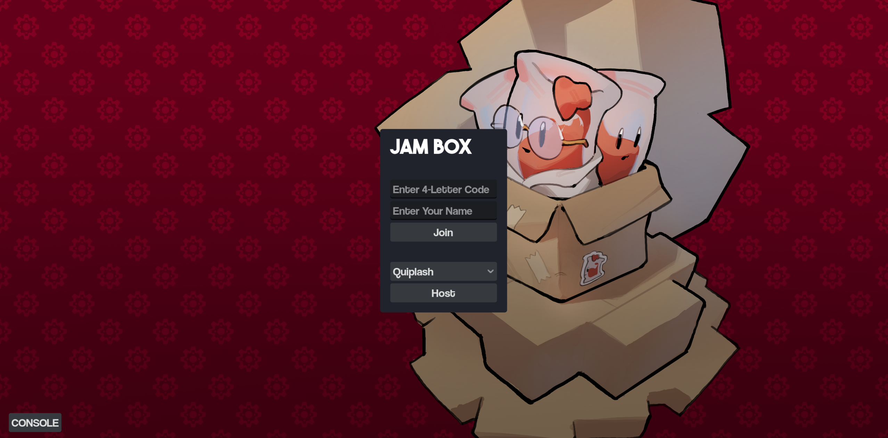

# 📦 Jam Box

A Jackbox like party game! Every semester members work together to contribute room games to the Jam Box.

## Developing

### Requirements

- [Rust](https://www.rust-lang.org/)
    - Please install Rust if you'd like to modify the relay server
- [Godot](https://godotengine.org/)
    - Please install Godot if you'd like to create new room games

### Structure

The game has two parts: the game client and the relay server. The **game client** is the actual web app that you play, and is made in Godot. The **relay server** is in charge of managing lobbies, and is made in Rust.

The client and server use WebSockets to communicate, and send packets that are recognized by both sides.

The games that players can host and join in Jam Box are called **room games**. When a player hosts a game, they create a **room/lobby** that other players can then join using a code.

- `Game` - Stores game client as a Godot Project
    -  `base_game` - The base client, including the main menu and lobby screen.
    -  `room_games` - Contains folders that represent a specific room game (ex. Quiplash) 
- `Relay` - Stores relay server code as a Rust project

### TODO

- [ ] The client and server currently cannot handle large packets
    - This is due to how TCP sockets work. TCP sockets communicate by send TCP packets with one another. When one side wants to send a message through the socket, [the entire message could potentially be split across multiple packets](https://stackoverflow.com/questions/64839516/python-tcp-server-receives-single-tcp-packet-split-into-multiple-packets). TCP only guarantees that the stream of data arrives in the same order to the other side. 
        - Since our messages are currently small, the data doesn't get split and the game works. However, if the game sent larger messages, they could end up getting split across multiple TCP packets 
    - The fix would be to first send the byte size of the packet stored as a fixed int32 before sending the packet itself. Then the receiving end would first read an int32 to get the `byte_size`, and then keep reading packet data into a buffer until `byte_size` bytes of information has been read. At that point, the receiver can remove `byte_size` bytes of information from the head of the buffer, and process this `byte_size` bytes of packet information as normal.